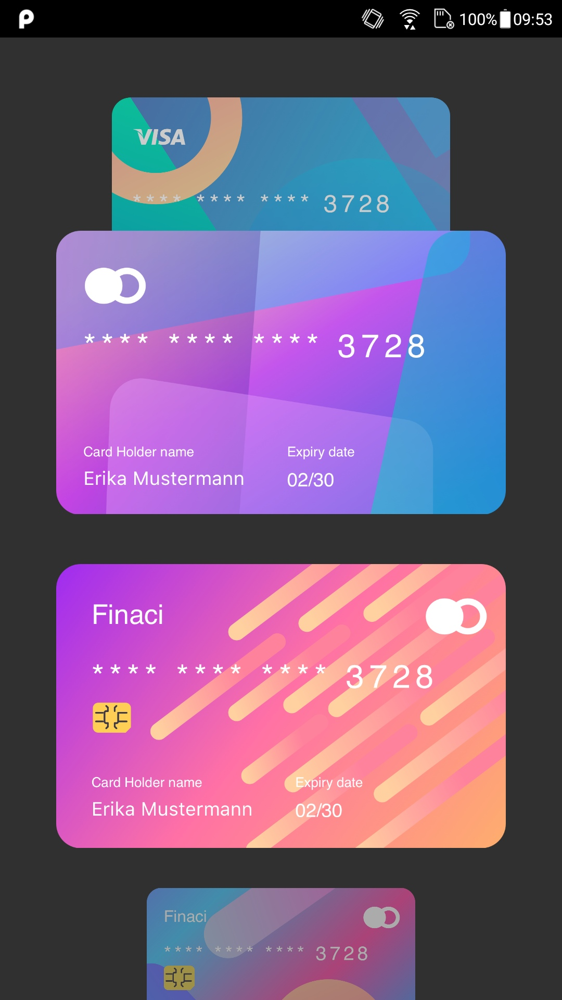

# WalletList - FlatList for Credit Cards :credit_card:

## Este projeto foi desenvolvido utilizando:

* ### [React-Native](https://reactnative.dev/)

## Tutorial de Execução

### Para instalação de dependências execute:

#### `yarn`

### Para executar o projeto use:

#### `yarn start`

### Para rodar no emulador/dispositivo use:

#### `npx react-native run-android`

### Onde me encontrar:

* ##### [LinkedIn](https://www.linkedin.com/in/lucas-vieira-urquiza)

* ##### [GitHub](https://github.com/lucasvurquiza)

* ##### [Instagram](https://www.instagram.com/lucas_urquiza)

* ##### [Gmail](mailto:urquizaxd@gmail.com)

* ##### [Outlook](mailto:lucasuvie@hotmail.com)

* ##### [WhatsApp](https://api.whatsapp.com/send?phone=5562996559459)

### Prints da Aplicação

#### Tela Principal

